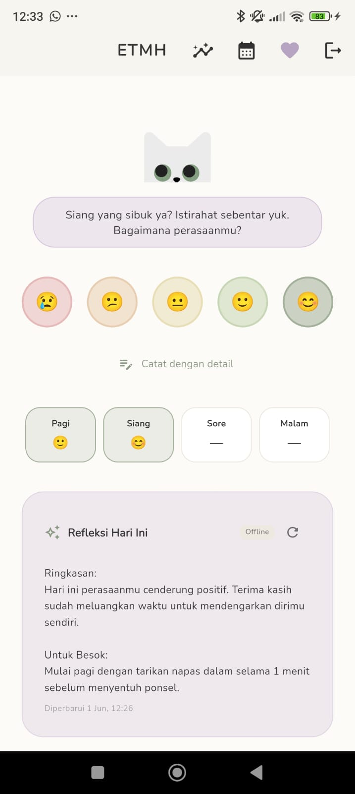
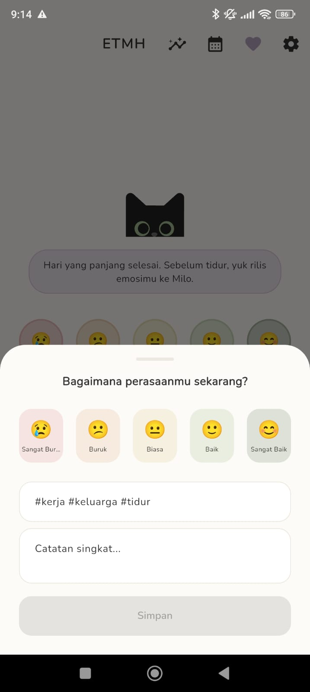
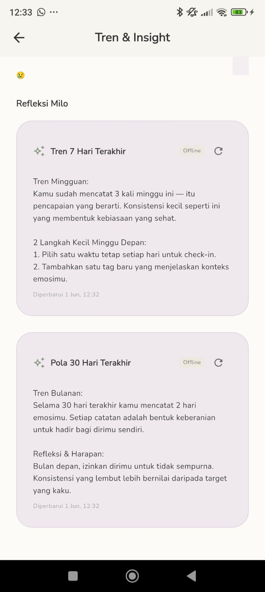

ETMH — Emotional Tracker for Mental Healt

> Aplikasi pelacak kesehatan mental & emosi dengan pendamping AI konselor yang hangat dan empatik. Dibangun dengan Flutter dan Clean Architecture.


---

## Demo

<!-- TODO: Ganti placeholder ini dengan screenshot / GIF aplikasimu.
     Letakkan file gambar di folder screenshots/ lalu sesuaikan nama di bawah. -->
<p align="center">
  
  
  
</p>

---

## Latar Belakang

Banyak orang kesulitan mengenali pola emosinya dari
     hari ke hari. ETMH memberi ruang aman untuk mencatat perasaan secara
     cepat, lalu menyajikan ringkasan dan dukungan reflektif berbasis AI
ETMH membantu pengguna mencatat kondisi emosi harian dan memahaminya melalui insight sederhana serta dialog dengan konselor AI.

## Fitur Utama

- Pencatatan emosi harian melalui **BottomSheet** yang nyaman dijangkau dengan satu tangan.
- Ringkasan & insight kondisi emosional yang ditampilkan dalam bentuk **card**.
- Pendamping AI berbasis **Google Gemini** dengan gaya bahasa yang hangat, empatik, dan santun.
- Penyimpanan data lokal dengan penanganan error yang aman.


## Design System — The Healing Palette

Palet warna dirancang untuk memberi kesan tenang dan menenangkan, sesuai konteks kesehatan mental.

| Token            | Hex       | Pratinjau                                                                 | Penggunaan              |
|------------------|-----------|---------------------------------------------------------------------------|-------------------------|
| Cream            | `#FDFBF7` |  | Background utama        |
| Sage Green       | `#A3B19B` |  | Tombol utama / sukses   |
| Dusty Lavender   | `#D6C7DE` |  | Card informasi / insight|
| Charcoal Grey    | `#333333` |  | Teks utama              |

Implementasi disentralisasi pada satu file tema (`lib/core/theme/app_colors.dart`) agar konsisten dan mudah dirawat.

## Arsitektur

Proyek mengikuti **Clean Architecture** sederhana dengan tiga lapisan dan satu arah dependensi (Presentation → Domain → Data).

```
┌─────────────────────────────────────────────┐
│                PRESENTATION                  │
│   Widgets, Pages, BottomSheets, State Mgmt   │
│           (Provider / BLoC)                  │
└───────────────────┬─────────────────────────┘
                    │ memanggil
                    ▼
┌─────────────────────────────────────────────┐
│                   DOMAIN                     │
│      Entities, Repository (abstract),        │
│                  UseCases                    │
└───────────────────┬─────────────────────────┘
                    │ diimplementasikan oleh
                    ▼
┌─────────────────────────────────────────────┐
│                    DATA                      │
│   Models, Repository Impl, DataSources       │
│   (Local DB, Gemini Service)  + try-catch    │
└─────────────────────────────────────────────┘
```

Prinsip yang dipegang:
- Lapisan dalam (Domain) tidak tahu apa-apa tentang lapisan luar.
- Semua operasi database dibungkus `try-catch` dan mengembalikan hasil yang aman (mis. `Either`/`Result` atau melempar `Failure` yang tertangani).
- State management dipakai **konsisten** (pilih salah satu: Provider **atau** BLoC).

## Tech Stack

| Kategori          | Teknologi                          |
|-------------------|------------------------------------|
| Framework         | Flutter (Dart)                     |
| State Management  | Provider / BLoC                    |
| AI                | Google Gemini API                  |
| Database Lokal    | <!-- TODO: SQLite / Hive / Isar --> |


## Cara Menjalankan

1. **Clone repositori**
   ```bash
   git clone https://github.com/USERNAME/etmh.git
   cd etmh
   ```

2. **Install dependencies**
   ```bash
   flutter pub get
   ```

3. **Siapkan API key Gemini**
   Salin `config.example.json` menjadi `config.json`, lalu isi dengan key milikmu sendiri (dapatkan gratis di [Google AI Studio](https://aistudio.google.com/app/apikey)):
   ```bash
   cp config.example.json config.json
   ```
   ```json
   {
     "GEMINI_API_KEY": "punyamu_di_sini"
   }
   ```
   > `config.json` sudah masuk `.gitignore` dan tidak akan ikut ter-commit.

4. **Jalankan aplikasi**
   ```bash
   flutter run --dart-define-from-file=config.json
   ```

## Keamanan & Privasi

- API key tidak pernah di-hardcode; di-inject saat runtime via `--dart-define-from-file`.
- Data emosi pengguna disimpan **lokal** di perangkat.
- **Keterbatasan yang diketahui:** memanggil Gemini langsung dari sisi klien berarti key teoritis bisa diekstrak dari APK yang sudah dikompilasi. Untuk versi produksi, panggilan AI sebaiknya diproksikan melalui backend (mis. Cloud Functions) agar key tidak pernah berada di perangkat. Pada repositori portofolio ini hal tersebut sengaja disederhanakan.

## Struktur Folder

```
lib/
├── core/
│   ├── theme/          # app_colors.dart (Healing Palette), text styles
│   └── error/          # Failure / exception handling
├── data/
│   ├── datasources/    # local DB, gemini_service.dart
│   ├── models/
│   └── repositories/   # implementasi repository
├── domain/
│   ├── entities/
│   ├── repositories/   # kontrak abstract
│   └── usecases/
└── presentation/
    ├── pages/
    ├── widgets/        # termasuk BottomSheet input emosi
    └── providers/      # atau blocs/
```


## Lisensi

Dirilis di bawah Lisensi MIT. Lihat file [LICENSE](LICENSE) untuk detail.

---

Dibuat oleh **Claudio** — https://www.linkedin.com/in/claudio-jafna-ibrani-319722218/
